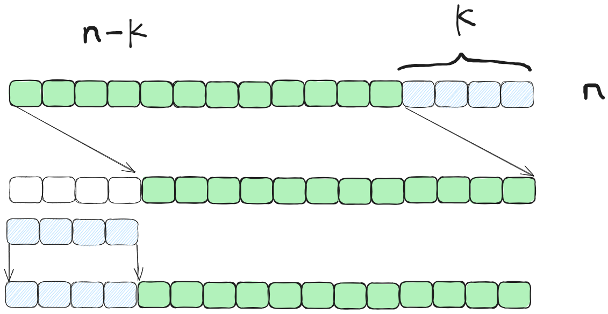
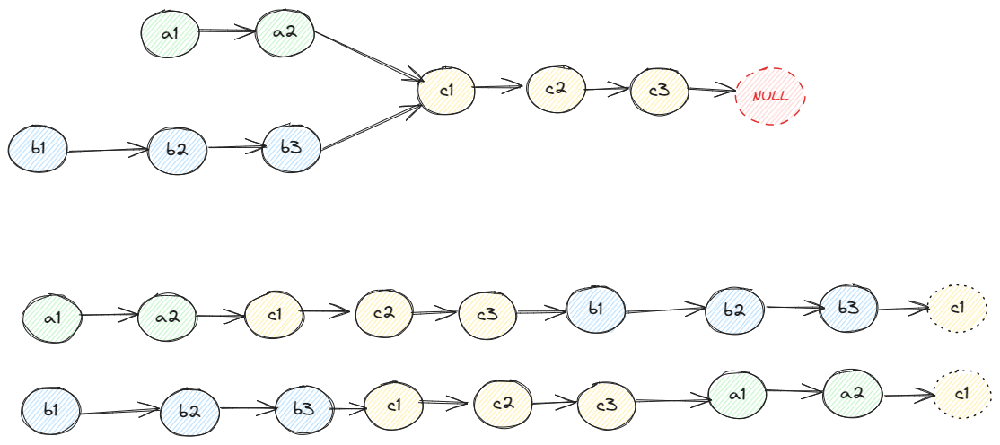
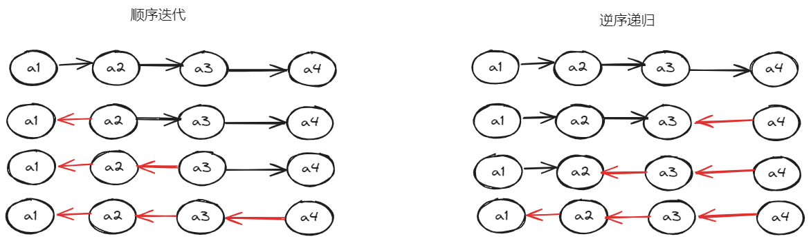
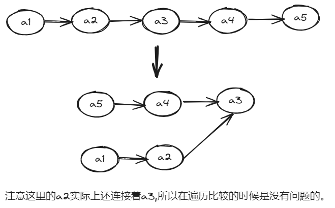
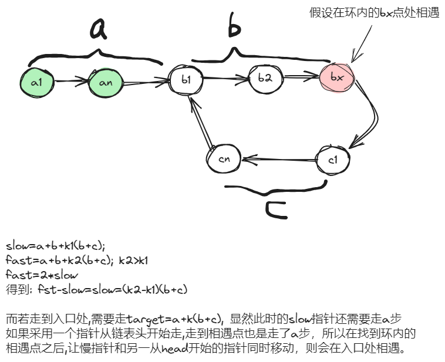
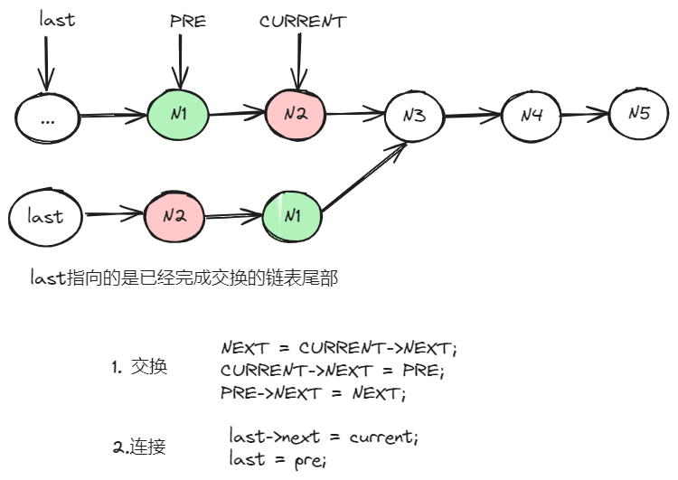
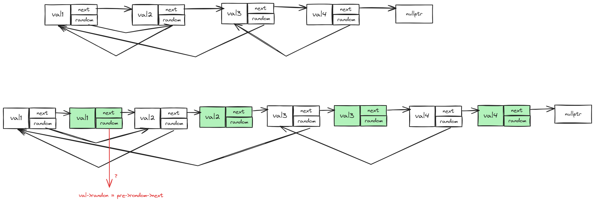

- [leetcode100](#leetcode100)
  - [01 两数之和](#01-两数之和)
  - [02 字母异或词分组](#02-字母异或词分组)
  - [03 最长连续数字序列](#03-最长连续数字序列)
  - [04 移动0元素](#04-移动0元素)
  - [05 盛最多水的容器](#05-盛最多水的容器)
  - [06 三数之和](#06-三数之和)
  - [07 接雨水](#07-接雨水)
  - [08 最长不重复的字串](#08-最长不重复的字串)
  - [09 寻找所有的字母异位词](#09-寻找所有的字母异位词)
  - [10 和为k的子数组](#10-和为k的子数组)
    - [1.暴力解法](#1暴力解法)
    - [2.保存求和结果](#2保存求和结果)
    - [3.使用map代替数组](#3使用map代替数组)
    - [4.优化之后的一次遍历](#4优化之后的一次遍历)
  - [11 滑动窗口内的最大值](#11-滑动窗口内的最大值)
  - [12 最小覆盖子串](#12-最小覆盖子串)
  - [13 最大子数组和](#13-最大子数组和)
    - [暴力求解](#暴力求解)
    - [动态规划](#动态规划)
  - [14 合并区间](#14-合并区间)
  - [15 轮转数组](#15-轮转数组)
    - [内存拷贝](#内存拷贝)
    - [多次反转](#多次反转)
  - [16 除自身之外的累积结果](#16-除自身之外的累积结果)
  - [17 数组中缺失的第一个正数](#17-数组中缺失的第一个正数)
    - [hash表](#hash表)
    - [将元素放到正确位置上](#将元素放到正确位置上)
  - [18 矩阵置零](#18-矩阵置零)
    - [使用额外标记数组](#使用额外标记数组)
    - [在原数组中存储标记信息](#在原数组中存储标记信息)
  - [19 螺旋矩阵](#19-螺旋矩阵)
  - [20 旋转图像](#20-旋转图像)
  - [21 搜索二维矩阵](#21-搜索二维矩阵)
  - [22 相交链表](#22-相交链表)
  - [23 反转链表](#23-反转链表)
  - [24 回文链表](#24-回文链表)
  - [25 环形链表](#25-环形链表)
  - [26 环形链表的入口](#26-环形链表的入口)
  - [27 合并两个有序链表](#27-合并两个有序链表)
  - [28 两数相加](#28-两数相加)
  - [29 删除链表中倒数第n个节点](#29-删除链表中倒数第n个节点)
  - [30 两两交换链表节点](#30-两两交换链表节点)
  - [31 K个一组反转链表](#31-k个一组反转链表)
  - [32 随机链表的复制](#32-随机链表的复制)
  - [33 排序链表](#33-排序链表)
  - [34 合并k个有序链表](#34-合并k个有序链表)
  - [35 LRU缓存](#35-lru缓存)
  - [36 二叉树的中序遍历](#36-二叉树的中序遍历)
  - [37 二叉树的最大深度](#37-二叉树的最大深度)
  - [38 翻转二叉树](#38-翻转二叉树)
  - [39 对称二叉树](#39-对称二叉树)
  - [40 二叉树的直径](#40-二叉树的直径)
  - [41 二叉树的层序遍历](#41-二叉树的层序遍历)
  - [42 有序数组转化成平衡二叉搜索树](#42-有序数组转化成平衡二叉搜索树)

# leetcode100

## 01 两数之和

[两数之和](https://leetcode.cn/problems/two-sum/description/?envType=study-plan-v2&envId=top-100-liked)

## 02 字母异或词分组

[字母异或词分组](https://leetcode.cn/problems/group-anagrams/description/?envType=study-plan-v2&envId=top-100-liked)

## 03 最长连续数字序列

[最长连续序列](https://leetcode.cn/problems/longest-consecutive-sequence/?envType=study-plan-v2&envId=top-100-liked)

```text
输入：nums = [100,4,200,1,3,2]
输出：4
解释：最长数字连续序列是 [1, 2, 3, 4]。它的长度为 4。

思路: 这个题目要求时间复杂度为O(n), 所以就不能最输入序列最排序或者使用红黑树的结构存储
方法1: 先使用hash map存储, 再一次遍历原数组，尽可能从序列的最小元素可以计算最长序列(当前元素n,若n-1在map中 则直接跳过)
方法2: dp[k]表示k元素所在最长序列长度, dp[k]=dp[k-1]+dp[k+1], 每次更新dp时只需要更新当前位置、新拼接序列的起始和结束位置。重复元素不再进行计算
```

## 04 移动0元素

[移动零](https://leetcode.cn/problems/move-zeroes/submissions/507246693/?envType=study-plan-v2&envId=top-100-liked)

```text
给定一个数组 nums，编写一个函数将所有 0 移动到数组的末尾，同时保持非零元素的相对顺序。
请注意 ，必须在不复制数组的情况下原地对数组进行操作
输入: nums = [0,1,0,3,12]
输出: [1,3,12,0,0]
思路:
慢指针指向0元素位置,快指针指向非0元素位置
```

## 05 盛最多水的容器

[盛最多水的容器](https://leetcode.cn/problems/container-with-most-water/description/?envType=study-plan-v2&envId=top-100-liked)


```text
双指针情况下，需要明确:
- 头尾指针分别指向开始和结尾，这样每次移动时容器宽度都是减小的
- 判断移动左指针还是右指针，只有移动短的边才**有可能**使容量变大。 (3, 6), 若移动长边->(3, 1)(容量变小) (3, 4)(容量不变) (3, 7)(容量不变),
  若移动短边 -> (1, 6)(容量变小)  (4, 6)(容量变大) (8, 6)(容量变大)
```

## 06 三数之和

[三数之和](https://leetcode.cn/problems/3sum/description/?envType=study-plan-v2&envId=top-100-liked)

```text
题目要求不重复,所以重点在于如何去重，如果时服用两数之和的思路，是行不通的。
关键在于认识到先对数组排序，接着再递增数组上使用双指针做两数之和，同时注意在找到一组元素时，最相邻元素去重。
```

## 07 接雨水

[接雨水](https://leetcode.cn/problems/trapping-rain-water/description/?envType=study-plan-v2&envId=top-100-liked)

```text
最开始的想法是，每次寻找一个凹槽(先降后升)，计算槽内的蓄水量，但是后面发现，当前槽的高度会受后面槽的影响。
做这个题目首先要明确, k位置的蓄水量实际上是由左右两侧最高的墙决定的。所以我们的目标就是取计算每个位置左右两侧height的最大值。
计算k左侧的最大值,需要从左到右遍历数组, 计算k右侧的最大值则需要从右到左遍历数组。
最简单的可以直接两次循环计算出两个数组存放left_max,right_max;
进而,我们发现[left_max] 从左向右递增,[right_max]从右到左递增,可以使用双指针在遍历时同时计算出水位,设左指针位置ptr1,右指针位置ptr2,
此时我们能计算出 ptr1的{left_max, x}, ptr2的{y, right_max},已知ptr1<ptr2, x >= right_max, y>=left_max 若此时left_max < right_max,则 left_max < right_max <=x,
也就是说ptr1位置的墙高为left_max,同理若 left_max >= right_max，则 y>=left_max >= right_max， ptr2的墙高为 right_max
```


## 08 最长不重复的字串

[最长不重复的字串](https://leetcode.cn/problems/longest-substring-without-repeating-characters/description/?envType=study-plan-v2&envId=top-100-liked)

```text
输入: s = "abcabcbb"
输出: 3 
解释: 因为无重复字符的最长子串是 "abc"，所以其长度为 3。

在统计到重复元素时，此时的遍历位置应该重置到该位置的下一位，同时子串进行删除或者标记。例如遍历到index=3时发现右重复字符'a'，此时字串起点应该向前移动到index=2位置
```
```C++
class Solution {
public:
  int lengthOfLongestSubstring(string s) {
    if (s.empty()) {
      return 0;
    }
    //  key;s中的元素ele val:ele最后出现的位置
    std::unordered_map<char, int> count; 
    int max_val = 1;
    int left = 0; // 当前最长不重复串的起始位置
    for (int index = 0; index < s.size(); ++index) {
      auto itr = count.find(s[index]);
      // 出现重复,此时需要移动左侧指针,移动到重复元素的下一个位置
      if (itr != count.end()) {
        // a b b a, 重复元素的下标有可能在left左侧，所以这里取了一个max
        left = std::max(itr->second + 1, left);
      }
      count[s[index]] = index;
      max_val = std::max(max_val, index - left + 1);
    }
    return max_val;
  }

  int solution1(string s) {
    std::vector<char> count;
    int max_val = 0;
    for (char ele : s) {
      auto itr = std::find(count.begin(), count.end(), ele);
      // 如果发现重复,则从重复元素的下一个位置开始重新计算
      if (itr != count.end()) {
        count.erase(count.begin(), ++itr);
      }
      count.push_back(ele);
      max_val = std::max(max_val, int(count.size()));
    }
    return max_val;
  }
};
```

## 09 寻找所有的字母异位词

[寻找所有的字母异位词](https://leetcode.cn/problems/find-all-anagrams-in-a-string/description/?envType=study-plan-v2&envId=top-100-liked)

```text
使用map或者vector统计目标字符的词频,判断map或vector是否相等也就是判断两个串是否为异位词。窗口大小固定，每次出一个元素进入一个元素，相应的修改词频
```

## 10 和为k的子数组

[和为k的子数组](https://leetcode.cn/problems/subarray-sum-equals-k/?envType=study-plan-v2&envId=top-100-liked)

```
给你一个整数数组 nums 和一个整数 k ，请你统计并返回 该数组中和为 k 的子数组的个数。
子数组是数组中元素的连续非空序列。
输入：nums = [1,2,3], k = 3
输出：2 存在{1, 2} {3}两个序列
```

### 1.暴力解法
直接计算所有子序列的和,此时的时间复杂度为n^2
```C++
int subarraySum(vector<int> &nums, int k) {
  int ret = 0;
  for (int i = 0; i < nums.size(); ++i) {
    // 计算从i开始的所有子序列的和
    int sum = 0;
    for (int j = i; j < nums.size(); ++j) {
      sum += nums[j];
      if (sum == k) {
        ++ret;
      }
    }
  }
  return ret;
}
```

### 2.保存求和结果

显然,在暴力解法中我们存在多次计算子序列和,i < j < k 时, k开始的子序列和被计算了多次。
那么我们想到计算一次保存起来dp[i] 表示[i, END] i开始到结尾的子序列和。
**若存在一个区间 [i,j]的和为t,则右这样的关系 dp[i]-dp[j]+nums[j]=t,其中 i<=j**,那么显然我们从后向前遍历一次即可

![[i,j]区间的和](./leetcode/img/连续子序列和.png)


```C++
int subarraySum2(vector<int> &nums, int k) {
  int ret = 0;
  std::vector<int> dp(nums.size()); // dp[i] 表示从i开始到结尾的子序列长度
  int sum = 0;
  for (int i = nums.size() - 1; i >= 0; --i) {
    sum += nums[i];
    dp[i] = sum;
  }

  for (int index = nums.size() - 1; index >= 0; --index) {
    int diff = dp[index] + k - nums[index];
    // dp[i]=dp[j]+k-nums[j],其中i<j, 显然dp[i]的值可以直接求出来，剩下的就是判断dp[i]是否真的在求和数组中
    auto itr = std::find(dp.begin(), dp.end(), diff);
    if (itr != dp.end() && (itr - dp.begin()) <= index) {
      ++ret;
    }
  }
  return ret;
}
```

### 3.使用map代替数组
在方法2中我们使用了数组保存求和的结果，但是在从右向左遍历时，每一次都要在数组中查找是否真的存在这个值，以及这个值的下标是否符合条件。对于查找问题，显然我们更希望通过map实现

我们需要解决的问题有下面几个:
- map是保存求和结果的,所以key是和，那么val是什么呢
- 我们需要保存下标信息，帮助我们判断 i < j 这种关系
- 我们在遍历的时候需要根据下标得到求和结果
最简单的想法，map key保存的是和,val保存的是子序列的起始位置(可能多个子序列的和相同)；同时使用一个数组保存求和结果，便于根据下标得到和

```c++
int subarraySum3(vector<int>& nums, int k) {
    int ret = 0;
    std::unordered_map<int, std::vector<int>> count; // key:sum val:子序列的起始位置
    std::vector<int> sum_vec(nums.size(), 0);
    int sum = 0;
    for(int i = nums.size() - 1; i >=0 ; --i){
        sum += nums[i];
        count[sum].push_back(i);
        sum_vec[i]=sum;
    }

    for(int index = nums.size() - 1; index >=0; --index){
        int diff = sum_vec[index] + k - nums[index];
        auto itr = count.find(diff);
        if(itr == count.end()){
            continue;
        }
        for(auto ele : itr->second){
            ret += (ele <= index);
        }
    }
    return ret;
}
```

### 4.优化之后的一次遍历
但从方法3的写法上看，显然 sum_vec数组是多余的，因为从右向左遍历时，我们可以顺便计算出dp[i]
```C++
int ret = 0;
std::unordered_map<int, std::vector<int>> count; // key:sum val:子序列的起始位置
int sum = 0;
for(int i = nums.size() - 1; i >=0 ; --i){
    sum += nums[i];
    count[sum].push_back(i);

}

int sum_vec = 0;
for(int index = nums.size() - 1; index >=0; --index){
    sum_vec += nums[index];
    int diff = sum_vec + k - nums[index];
    auto itr = count.find(diff);
    if(itr == count.end()){
        continue;
    }
    for(auto ele : itr->second){
        ret += (ele <= index);
    }
}
return ret;
```

进一步我们想，从右到左遍历，我们希望 i < j, 也就是说满足条件的 i 在遍历时可能还没办法计算出来。那么我们先把我们的期望值存起来，再向左计算的过程中看看是否出现了期望值
```C++
int ret = 0;
int current_sum = 0;
std::unordered_map<int , int> predicted;  // key 希望的子序列和, val:有多少个位置希望前方能出现这个和
for(int index = nums.size() - 1; index >=0; --index){
    current_sum += nums[index]; // current_sum表示的是 [index, END]子序列的和，也就是dp[index]
    int diff = current_sum + k - nums[index]; // diff 表示满足条件时，dp[x]的值，其中 0 <=x <=index,因为我们的迭代顺序,x显然时满足[0, index]的
    predicted[diff]++;  // 将这个值放入期望map中
    auto itr = predicted.find(current_sum);
    if(itr != predicted.end()){ // 当前的dp[index]能够满足 [index,END]的期望
        ret += itr->second;
    }
}
return ret;
```

## 11 滑动窗口内的最大值

[滑动窗口内的最大值](https://leetcode.cn/problems/sliding-window-maximum/?envType=study-plan-v2&envId=top-100-liked)

```text
输入：nums = [1,3,-1,-3,5,3,6,7], k = 3
输出：[3,3,5,5,6,7]
解释：
滑动窗口的位置                最大值
---------------               -----
[1  3  -1] -3  5  3  6  7       3
 1 [3  -1  -3] 5  3  6  7       3
 1  3 [-1  -3  5] 3  6  7       5
 1  3  -1 [-3  5  3] 6  7       5
 1  3  -1  -3 [5  3  6] 7       6
 1  3  -1  -3  5 [3  6  7]      7

难点在于如何在O(1)复杂度内找到当前窗口内的最大值
思路: 比较关键的时需要认识到 i< j, nums[j] >= nums[i],i,j都在一个窗口内时,nums[i]不可能时窗口内的最大值。
- 可以使用双端队列(头部到尾部非递增)，保存下标，来保证队列内为窗口内的元素
- 满足上述条件时，删除元素
- 对头为当前窗口最大值

当前也可以使用大根堆实现,取堆顶元素时判断是否超出窗口
```

## 12 最小覆盖子串

[最小覆盖子串](https://leetcode.cn/problems/minimum-window-substring/?envType=study-plan-v2&envId=top-100-liked)

```text
输入：s = "ADOBECODEBANC", t = "ABC"
输出："BANC"
解释：最小覆盖子串 "BANC" 包含来自字符串 t 的 'A'、'B' 和 'C'。
```

暴力解法中,验证每个子序列,存在一些字串的信息被重复计算的情况。而使用滑动窗口,当前子串的信息始终包含在窗口内,移动滑动时更新这些信息，无需双重循环。
```C++
std::unordered_map<char, int> count; // 目标串的词频
for (char c : t) {
  ++count[c];
}

int start_pos = -1;                // 符合条件的子串起始位置
int len = INT_MAX;                 // 符合条件的子串长度
std::unordered_map<char, int> pre; // map中只存放s中的字符统计

int left = 0; // left指向窗口左边,right指向窗口右边
for (int right = 0; right < s.size(); ++right) {
  if (!count.count(s[right])) {
    continue;
  }
  ++pre[s[right]];
  // 检测当前当前窗口是否满足要求，不能直接使用map
  // .operator==(),实际上在窗口内ele出现次数大于target的中ele的词频也是OK的
  while (equal(count, pre) && left <= right) {
    if (right - left + 1 < len) {
      len = right - left + 1;
      start_pos = left;
    }
    // 左指针向右移动,同时修改词频map
    if (pre.count(s[left])) {
      --pre[s[left]];
    }
    ++left;
  }
}
return start_pos < 0 ? "" : s.substr(start_pos, len);
```

## 13 最大子数组和

[最大子数组和](https://leetcode.cn/problems/maximum-subarray/description/?envType=study-plan-v2&envId=top-100-liked)

```text
输入：nums = [-2,1,-3,4,-1,2,1,-5,4]
输出：6
解释：连续子数组 [4,-1,2,1] 的和最大，为 6 。
```

### 暴力求解

又是子序列的问题,首先想到的是暴力求解,求和所有子序列的和。
```C++
int maxSubArray(vector<int> &nums) {
  int ret = INT_MIN;
  for (int i = 0; i < nums.size(); ++i) {
    int sum = 0;
    for (int j = i; j < nums.size(); ++j) {
      sum += nums[j];
      ret = std::max(ret, sum);
    }
  }
  return ret;
}
```

### 动态规划

暴力求解的时候，由于我们是从左到右遍历,对于序列[i, j]会重复计算多次这个序列的和。那么我们自然想到使用数组保存dp[i][j]保存[i,j]序列的和，
但是即便是这样。在第二层循环中我们需要找到dp[i, j], i<=j<=nums.size()==END 中的最大值，显然时间复杂度没有变化。所以我们更想更快的知道[i，END]范围内最大和的子序列.
而[i,END]范围内的最大和S(i)显然依赖于[i-1,END]范围内的最大和S(i-1),可见一个有状态依赖的动态规划出来了。
dp[i]表示[i,END]最大和,则dp[i] = nums[i], dp[i-1] <0,否则dp[i] = dp[i-1]+nums[i]
```C++
int maxSubArray(vector<int>& nums) {
  int ret = nums.back();
  int last_sum = nums.back();
  for(int index = nums.size() - 2; index >=0; --index){
      last_sum = nums[index] + (last_sum < 0 ? 0 : last_sum);
      ret = std::max(last_sum, ret);
  }
  return ret;
}
``` 

## 14 合并区间

[合并区间](https://leetcode.cn/problems/merge-intervals/description/?envType=study-plan-v2&envId=top-100-liked)

```text
输入：intervals = [[1,3],[2,6],[8,10],[15,18]]
输出：[[1,6],[8,10],[15,18]]
解释：区间 [1,3] 和 [2,6] 重叠, 将它们合并为 [1,6].
```

按照数组中的左边界进行排序,然后依次合并。


## 15 轮转数组

[轮转数组](https://leetcode.cn/problems/rotate-array/description/?envType=study-plan-v2&envId=top-100-liked)

```text
输入: nums = [1,2,3,4,5,6,7], k = 3
输出: [5,6,7,1,2,3,4]
解释:
向右轮转 1 步: [7,1,2,3,4,5,6]
向右轮转 2 步: [6,7,1,2,3,4,5]
向右轮转 3 步: [5,6,7,1,2,3,4]
```

### 内存拷贝



需要提前将尾部的数据保存起来。
```C++
void rotate1(vector<int> &nums, int k) {
  if (nums.empty() || ((k % nums.size()) == 0)) {
    return;
  }
  int res = k % nums.size();
  std::vector<int> tail_nums(nums.begin() + nums.size() - res, nums.end());
  // 注意这里的nums.data() 返回的是 int*, 而第三个参数是字节为单位
  memmove(nums.data() + res, nums.data(), (nums.size() - res) * sizeof(int));
  memmove(nums.data(), tail_nums.data(), tail_nums.size() * sizeof(int));
}
```

### 多次反转

```C++
void rotate(vector<int> &nums, int k) {
  if (nums.empty() || ((k % nums.size()) == 0)) {
    return;
  }
  int res = k % nums.size();
  // 首先全部反转
  reverse(nums, 0, nums.size() - 1);
  // 然后依次反转前后两端内容
  reverse(nums, 0, res - 1);
  reverse(nums, res, nums.size() - 1);
}
```

## 16 除自身之外的累积结果

[除自身以外数组的乘积](https://leetcode.cn/problems/product-of-array-except-self/description/?envType=study-plan-v2&envId=top-100-liked)

```text
输入: nums = [1,2,3,4]
输出: [24,12,8,6]
```

dp[i] 保存 [i, END]的累积结果。然后从左到右遍历的时候可以计算[0, i]的累积结果, 两者相乘得到该位置上的结果。

```C++
vector<int> productExceptSelf(vector<int>& nums) {
    vector<int> tail_results(nums.size(), nums.back());
    for(int index = nums.size() -2; index >=0; --index){
        tail_results[index] = tail_results[index+1]*nums[index];
    }

    int head_result  = 1;
    // 这里也可以使用额外的数组保存最后的结果；但是我们注意到 每次计算results[index]时只使用了tail_results[index+1]，也就是可以直接复用tail_results
    for(int index = 0; index < nums.size(); ++index){
        int right_val = index + 1 < nums.size() ? tail_results[index+1] : 1;
        int left_val =  index - 1 >= 0 ? head_result : 1;
        tail_results[index] = right_val * left_val;
        head_result *= nums[index];
    }

    return tail_results;
}
```

## 17 数组中缺失的第一个正数

[数组中缺失的第一个正数](https://leetcode.cn/problems/first-missing-positive/description/?envType=study-plan-v2&envId=top-100-liked)

```text
给你一个未排序的整数数组 nums ，请你找出其中没有出现的最小的正整数。
输入：nums = [3,4,-1,1]
输出：2
解释：1 在数组中，但 2 没有。
```

### hash表

数组元素存入hash表,方便O(1)时间查找某个元素是否缺失


### 将元素放到正确位置上

对于一个长度为n的数组,合理的数值范围是[1, n],那么我们通过遍历数组将array[i] 不断交换尝试放到[i+1]位置上.最后遍历数组查看哪个位置不满足 array[i] = i+1

```C++
for (int index = 0; index < nums.size(); ++index) {
  // 当前位置不满足 nums[i] == i + 1,尝试交换到正确位置上
  while (nums[index] != index + 1) {
    // 为防止因为缺失数据引起的无限循环,需要提前终止
    if (nums[index] <= 0 || nums[index] > nums.size() ||
        nums[index] == nums[nums[index] - 1]) {
      break;
    }
    // 交换 nums[i] 到其理想位置nums[i] - 1 上
    std::swap(nums[index], nums[nums[index] - 1]);
  }
}
for (int index = 0; index < nums.size(); ++index) {
  if (nums[index] != index + 1) {
    return index + 1;
  }
}
return nums.size() + 1;
```

## 18 [矩阵置零](https://leetcode.cn/problems/set-matrix-zeroes/description/?envType=study-plan-v2&envId=top-100-liked)


给定一个 m x n 的矩阵，如果一个元素为 0 ，则将其所在行和列的所有元素都设为 0 。请使用 原地 算法。

### 使用额外标记数组

使用两个数组分别记录哪些行和哪些列存在0元素,然后一次遍历矩阵,若该位置有对应的行列0标记,则置0
```C++
void setZeroes(std::vector<std::vector<int>> &matrix) {
  if (matrix.empty()) {
    return;
  }
  // 标记哪些行和哪些列存在0元素，空间复杂度O(m+n),时间复杂度O(m*n)
  std::vector<bool> row_flags(matrix.size(), false);
  std::vector<bool> col_flags(matrix[0].size(), false);

  for (int row = 0; row < matrix.size(); ++row) {
    for (int col = 0; col < matrix[0].size(); ++col) {
      row_flags[row] = row_flags[row] || (matrix[row][col] == 0);
      col_flags[col] = col_flags[col] || (matrix[row][col] == 0);
    }
  }

  for (int row = 0; row < matrix.size(); ++row) {
    for (int col = 0; col < matrix[0].size(); ++col) {
      // 该元素所在的行或者列存在0元素,则该元素置零
      if (row_flags[row] || col_flags[col]) {
        matrix[row][col] = 0;
      }
    }
  }
}
```

### 在原数组中存储标记信息

使用元组中的某一行存储哪些列有0标记,使用某一列存储哪些行有0标记。此时有个问题,用于标记的这个行和列是无法表达自身是否具有0元素的，所以需要额外使用两个变量记录这个信息。
```C++
void setZeroes(std::vector<std::vector<int>> &matrix) {
  if (matrix.empty()) {
    return;
  }
  // 我们能否把标记数组放到原矩阵中？
  // 由于后续第一行和第一列需要存储标记位,最后无法确定第一行，第一列本身是否包含0,所以这项信息需要存储下来
  bool set_row = false, set_col = false;
  // 遍历第一列,看看第一列自身是否存在0元素
  for (int index = 0; index < matrix.size(); ++index) {
    if (matrix[index][0] == 0) {
      set_col = true;
      break;
    }
  }
  // 遍历第一行,看看第一行自身是否存在0元素
  for (int index = 0; index < matrix[0].size(); ++index) {
    if (matrix[0][index] == 0) {
      set_row = true;
      break;
    }
  }

  // 遍历除去标记行列的其他位置,设置标记位，储存在原矩阵的第一行和第一列
  for (int row = 1; row < matrix.size(); ++row) {
    for (int col = 1; col < matrix[0].size(); ++col) {
      if (matrix[row][col] == 0) {
        matrix[0][col] = 0; // 存储哪些列有0
        matrix[row][0] = 0; // 存储哪些行有0
      }
    }
  }

  for (int row = 1; row < matrix.size(); ++row) {
    for (int col = 1; col < matrix[0].size(); ++col) {
      // 该元素所在的行或者列存在0元素,则该元素置零
      if (matrix[row][0] == 0 || matrix[0][col] == 0) {
        matrix[row][col] = 0;
      }
    }
  }
  // 判断第一列
  if (set_col) {
    for (int index = 0; index < matrix.size(); ++index) {
      matrix[index][0] = 0;
    }
  }
  // 判断第一行
  if (set_row) {
    for (int index = 0; index < matrix[0].size(); ++index) {
      matrix[0][index] = 0;
    }
  }
}
```

## 19 [螺旋矩阵](https://leetcode.cn/problems/spiral-matrix/description/?envType=study-plan-v2&envId=top-100-liked)

给你一个 m 行 n 列的矩阵 matrix ，请按照 顺时针螺旋顺序 ，返回矩阵中的所有元素。

需要注意边界条件的判断。大循环内的前两次小循环,大循环保证上下和左右关系都是合理的，所以第一次小循环不用做额外的条件判断。
第二个小循环,自身能保证上下关系的合理,而left,right此时并未发生变化,所以左右关系也是满足的，因为也不用做额外判断。
第三个小循环,自身能保证左右关系的合理,而此时up值已经发生变动，是无法保证 up < down的,所以在第三个小循环开始之前需要额外一部判断上下关系是否合理,
同理第四个循环需要检查左右关系是否合理。
```C++
std::vector<int> spiralOrder(std::vector<std::vector<int>> &matrix) {
  int left = 0, right = matrix[0].size() - 1, up = 0, down = matrix.size() - 1;
  std::vector<int> ret;
  while (left <= right && up <= down) {
    // 遍历当前行(第up行,从左到右), [left, right]
    for (int index = left; index <= right; ++index) {
      ret.push_back(matrix[up][index]);
    }
    ++up;
    // 遍历第right列,从上到下
    for (int index = up; index <= down; ++index) {
      ret.push_back(matrix[index][right]);
    }
    --right;
    // 遍历第down行,从右到左.
    // 此时循环只关注左右关系,并没有注意到上下关系(up已经发生变化)的限制,避免出现重复此时要判断上下关系是否合理
    if (up > down) {
      break;
    }
    for (int index = right; index >= left; --index) {
      ret.push_back(matrix[down][index]);
    }
    --down;
    // 遍历第left列,从下到上.
    // 此时循环只关注上下关系,并没有注意到左右关系(right已发生变化)的限制,避免出现重复此时要判断左右关系是否合理
    if (left > right) {
      break;
    }
    for (int index = down; index >= up; --index) {
      ret.push_back(matrix[index][left]);
    }
    ++left;
  }
  return ret;
}
```

## 20 [旋转图像](https://leetcode.cn/problems/rotate-image/description/?envType=study-plan-v2&envId=top-100-liked)

给定一个 n × n 的二维矩阵 matrix 表示一个图像。请你将图像顺时针旋转 90 度。要求原地旋转


首先对于方阵中的某一点matrix[i][j],顺时针旋转90°后的点坐标为 (n-j-1, i). 则我们可以从外层到内层,依次交换这些点
```C++
void rotate(std::vector<std::vector<int>> &matrix) {
  int n = matrix.size(); // 方阵
  // 一圈一圈的遍历
  for (int current_row = 0; current_row < n / 2; ++current_row) {
    for (int current_col = current_row; current_col < n - current_row - 1;
         ++current_col) {
      int tmp = matrix[current_row][current_col];
      matrix[current_row][current_col] =
          matrix[n - current_col - 1][current_row];
      matrix[n - current_col - 1][current_row] =
          matrix[n - current_row - 1][n - current_col - 1];
      matrix[n - current_row - 1][n - current_col - 1] =
          matrix[current_col][n - current_row - 1];
      // matrix[current_col][n - current_row - 1] =
      // matrix[current_row][current_col];
      matrix[current_col][n - current_row - 1] = tmp;
    }
  }
}
``` 

## 21 [搜索二维矩阵](https://leetcode.cn/problems/search-a-2d-matrix-ii/description/?envType=study-plan-v2&envId=top-100-liked)

编写一个高效的算法来搜索 m x n 矩阵 matrix 中的一个目标值 target 。该矩阵具有以下特性：

每行的元素从左到右升序排列。
每列的元素从上到下升序排列。

矩阵的行列是由排序特征的,可以从右上角开始遍历,当前元素小于target时,向下移动,反之向左移动。

## 22 [相交链表](https://leetcode.cn/problems/intersection-of-two-linked-lists/description/?envType=study-plan-v2&envId=top-100-liked)



```C++
if(!headA || !headB){return nullptr;}
ListNode* ptr1 = headA, *ptr2 = headB;
while(ptr1 != ptr2){
    ptr1 = ptr1 == nullptr ? headB : ptr1->next;
    ptr2 = ptr2 == nullptr ? headA : ptr2->next;
}
return ptr1;
```

## 23 [反转链表](https://leetcode.cn/problems/reverse-linked-list/description/?envType=study-plan-v2&envId=top-100-liked)




从前往后,每次修改一个指针的指向
```C++
ListNode *reverseList(ListNode *head) {
  if (!head || !head->next) {
    return head;
  }
  ListNode *pre = nullptr;
  ListNode *current = head;
  while (current) {
    auto *next = current->next;
    // 反转 pre -> current 到 current -> pre,
    // 因为后面要移动current,所以需要临时保存current->next
    current->next = pre;
    pre = current;
    current = next;
  }
  return pre;
}
```

也可以通过递归,从后往前
```C++
ListNode *reverseList(ListNode *head) {
  if (!head || !head->next) {
    return head;
  }
  // head之后的节点已经反转完毕  head -> tmp <- x1，
  // tmp实际上一直是反转链表的头节点
  auto *reverse_head = reverseList(head->next);
  // head->next
  // 为已经反转的链表尾节点,将其指向head，也就是完成包括head在内的反转
  head->next->next = head;
  // 置空，避免出现环。这一步比较容易遗忘
  head->next = nullptr;

  return reverse_head;
}
```

## 24 [回文链表](https://leetcode.cn/problems/palindrome-linked-list/?envType=study-plan-v2&envId=top-100-liked)

回文意思就是从前往后遍历结果和从后往前遍历的结果时一样的。我们首先想到的是遍历一遍链表,将值存放到数组中,因为数组可以随机访问，可以很容易判断正序和逆序是否是相同的。
那么能否不使用额外的内存空间呢?
我们可以反转链表的后半段,然后依次判断前后两个半段的值是否相同。其中我们需要解决如何找到开始反转的中间节点，这里可以使用快慢指针，快指针到尾部时，慢指针走到中间。



```C++
bool isPalindrome(ListNode *head) {
  if (head == nullptr) {
    return false;
  }
  // 反转链表的后半部分,然后同前半部分进行值对比
  ListNode *slow = head, *fast = head;
  while (fast && fast->next) {
    slow = slow->next;
    fast = fast->next->next;
  }
  ListNode *reverse_node = reverseList(slow);
  ListNode *normal_node = head;
  while (reverse_node) {
    if (reverse_node->val != normal_node->val) {
      return false;
    }
    reverse_node = reverse_node->next;
    normal_node = normal_node->next;
  }
  return true;
}
```

## 25 [环形链表](https://leetcode.cn/problems/linked-list-cycle/submissions/513133687/?envType=study-plan-v2&envId=top-100-liked)

如果存在环,则在环内的快慢指针一定会相遇.
```C++
bool hasCycle(ListNode *head) {
  if (head == nullptr || head->next == nullptr) {
    return false;
  }
  ListNode *slow = head, *fast = head->next;

  while (slow != fast) {
    if (fast == nullptr || fast->next == nullptr) {
      return false;
    }
    slow = slow->next;
    fast = fast->next->next;
  }
  return true;
}
```

## 26 [环形链表的入口](https://leetcode.cn/problems/linked-list-cycle-ii/description/?envType=study-plan-v2&envId=top-100-liked)

关键在于找到相遇点后如何判断环的入口在哪里? 



```C++
ListNode *detectCycle(ListNode *head) {
  if (head == nullptr || head->next == nullptr) {
    return nullptr;
  }
  // 需要注意初始化是是让fast=head->next 还是fast=head; 这对于是否在找到相遇点后是否让slow=slow->next(前者需要,后者不需要)
  // 这里实际上是怎么定义长度,第一次赋值算不算1步。不算的话 fast=head，能满足从head到入口需要走a步,fast=2*slow
  // 若在这种情况下fast=head-next,实际上fast=2*slow+1,算出来slow需要走a+1，而head到入口的步数是固定的a步,所以此时slow需要先走一步在进入同步移动
  ListNode *slow = head, *fast = head->next;

  while (slow != fast) {
    if (fast == nullptr || fast->next == nullptr) {
      return nullptr;
    }
    slow = slow->next;
    fast = fast->next->next;
  }
  ListNode *length_helper = head;
  slow = slow->next;
  while (length_helper != slow) {
    length_helper = length_helper->next;
    slow = slow->next;
  }

  return slow;
}
```

## 27 [合并两个有序链表](https://leetcode.cn/problems/merge-two-sorted-lists/description/?envType=study-plan-v2&envId=top-100-liked)

常规方法,分别比较两个链表节点的val,p总是指向较小的那个节点。

也可以使用递归
```C++
ListNode *mergeTwoLists(ListNode *list1, ListNode *list2) {
  if (list1 == nullptr) {
    return list2;
  }
  if (list2 == nullptr) {
    return list1;
  }

  if (list1->val < list2->val) {
    // list1对应的值较小 继续向后递归
    list1->next = mergeTwoLists(list1->next, list2);
    return list1;
  } else {
    list2->next = mergeTwoLists(list1, list2->next);
    return list2;
  }
}
```

## 28 [两数相加](https://leetcode.cn/problems/add-two-numbers/description/?envType=study-plan-v2&envId=top-100-liked)


实际上就是简单的模拟加法,从头到尾遍历两个链表即可。注意最后的res需要再判断一下
```C++
ListNode *addTwoNumbers(ListNode *l1, ListNode *l2) {
  ListNode *ptr1 = l1, *ptr2 = l2;

  int res = 0;
  std::shared_ptr<ListNode> head = std::make_shared<ListNode>();
  ListNode *p = head.get();
  while (ptr1 || ptr2) {
    int sum = (ptr1 == nullptr ? 0 : ptr1->val) +
              (ptr2 == nullptr ? 0 : ptr2->val) + res;
    res = sum >= 10 ? 1 : 0;

    p->next = new ListNode(sum % 10);
    p = p->next;

    ptr1 = ptr1 == nullptr ? nullptr : ptr1->next;
    ptr2 = ptr2 == nullptr ? nullptr : ptr2->next;
  }

  if (res) {
    p->next = new ListNode(res);
  }

  return head->next;
}
```


## 29 [删除链表中倒数第n个节点](https://leetcode.cn/problems/remove-nth-node-from-end-of-list/description/?envType=study-plan-v2&envId=top-100-liked)

假设链表长度为len,我们知道倒数第n个节点,实际上就是删除第len-n个节点,也就是说如果我们知道链表长度,直接遍历到第len-n节点,进行删除就行。而计算长度有需要遍历依次链表。能否只写一个循环?
我们使用两个指针slow,fast,让fast先走n步,然后同步向前,当fast走到末尾时,slow也就走到了len-n位置

```C++
ListNode *removeNthFromEnd(ListNode *head, int n) {
  ListNode *fast = head, *slow = head;
  while (n--) {
    fast = fast->next;
  }
  // 此时删除的为头节点
  if (fast == nullptr) {
    return head->next;
  }
  // 定位到删除位置的前一个节点
  while (fast->next != nullptr) {
    slow = slow->next;
    fast = fast->next;
  }
  slow->next = slow->next->next;
  return head;
}
```

## 30 [两两交换链表节点](https://leetcode.cn/problems/swap-nodes-in-pairs/description/?envType=study-plan-v2&envId=top-100-liked)



```C++
ListNode *swapPairs1(ListNode *head) {
  if (head == nullptr || head->next == nullptr) {
    return head;
  }

  ListNode *pre = head, *current = head->next, *last_node = nullptr,
           *ret = head->next;

  while (pre && pre->next) {
    // 确定pre current节点
    current = pre->next;
    // 保存next节点,便于继续向下迭代
    auto *next = current->next;
    // 反转指针
    current->next = pre;
    pre->next = next;
    if (last_node) {
      last_node->next = current;
    }

    last_node = pre;

    // pre指针继续移动
    pre = next;
  }
  return ret;
}
```

## 31 [K个一组反转链表](https://leetcode.cn/problems/reverse-nodes-in-k-group/?envType=study-plan-v2&envId=top-100-liked)

同两两交换的题目是类似的,主要把握好,反转之后的头部、尾部和能够继续遍历下去的current这几个变量的赋值。

```C++
ListNode *reverseKGroup(ListNode *head, int k) {
  // p 指针用于遍历链表
  // start end 记录反转区间
  // last记录的是已经完成反转的链表尾部
  // ret为返回值,实际是第一次完成区间反转的头节点
  ListNode *p = head, *start = head, *end = nullptr, *ret = nullptr,
           *last = nullptr;
  int num = 0;
  while (p) {
    ++num;
    // 当前区间的链表需要反转
    if (num % k == 0) {
      // 明确当前段链表的起始节点[start, end]
      end = p;
      auto *next = end->next;
      // 为了能正常反转,这里需要对链表做截断,截断之前需要保证next
      end->next = nullptr;
      // 反转 [start, end] -> [end, start]
      reverse(start);
      // 连接起来, start这时候位于反转后的最后一个节点
      // 将反转后的链表加入到之前整个链表中
      if (last) {
        last->next = end;
      }
      start->next = next;
      // 记录返回值
      ret = ret == nullptr ? end : ret;
      // 更新,此时p为了继续向下迭代,指向当前最后一个元素
      p = last = start;
      start = next;
    }
    p = p->next;
  }
  return ret;
}
```

## 32 [随机链表的复制](https://leetcode.cn/problems/copy-list-with-random-pointer/description/?envType=study-plan-v2&envId=top-100-liked)


这个题目不太顺的一点是如何处理随机指针,从前往后遍历的时候,random指针指向的内容可能还没有被创建,如果没有被创建那么我们创建它,
后续它可能作为next指针的指向，所以我们还要将其保存起来并能够在根据原链表节点对应到该节点，自然而然我们想到使用map, key是原链表节点地址,val是新链表对应地址。
第一次遍历的时候填充map,第二次遍历的时候根据map信息连接random指针。

如果不使用map，如何表达新旧节点之间的关系，或者说如何根据旧节点定位到新节点呢?
我们可以借助链表前后关系的表示能力，将新的节点插入到原节点后面，这样random节点的对照关系就明确了。


```C++
Node *copyRandomList(Node *head) {
  // 1. copy一份链表连接在原链表的后面
  Node *p = head;
  while (p) {
    auto *next = p->next;
    p->next = new Node(p->val);
    p->next->next = next;
    p = next;
  }
  // 2. 连接random指针
  p = head;
  while (p) {
    auto *cur = p->next;
    cur->random = p->random == nullptr ? nullptr : p->random->next;
    p = cur->next;
  }

  // 3. 断开连接
  Node *ret = head->next;
  p = head;
  while (p) {
    auto* next = p->next->next;
    auto *new_node = p->next;
    p->next = new_node->next;
    new_node->next = new_node->next == nullptr ? nullptr : new_node->next->next;

    p = next;
  }

  return ret;
}
```

## 33 [排序链表](https://leetcode.cn/problems/sort-list/?envType=study-plan-v2&envId=top-100-liked)


链表的排序难点在于不像数组一样可以随机访问任意元素，节点的交换也相对复杂。推荐是使用归并排序,先将小段的链表变得有序，然后分别合并有序的部分。

```C++
ListNode *sortList2(ListNode *head) {
  if (head == nullptr || head->next == nullptr) {
    return head;
  }
  ListNode *p = head;
  int len = GetLength(head);
  ListNode *ret = head; // ret 存储每次排序结束的头节点位置
  // index 表示当前参与排序的两个链表的长度
  for (int index = 1; index < len; index = 2 * index) {
    p = ret;
    ListNode *list1 = p, *list2 = nullptr;
    std::shared_ptr<ListNode> __ = std::make_shared<ListNode>(0);
    // connect 用于连接本次排序后的链表
    ListNode *connect = __.get();
    while (p) {
      // list1 list2 分别是两段链表的头节点
      list1 = p;
      // 寻找 list2
      for (int i = 1; i < index && p->next; ++i) {
        p = p->next;
      }
      list2 = p->next;
      // 将list1 截断成独立链表，便于合并
      p->next = nullptr;
      // 寻找final
      p = list2;
      for (int i = 1; i < index && p && p->next; ++i) {
        p = p->next;
      }
      auto *final = p ? p->next : nullptr;
      // 将list2 截断成独立链表
      if (p != nullptr) {
        p->next = nullptr;
      }
      // 对两段有序部分进行合并
      auto sorted_list = mergeList2(list1, list2);
      // 将本次排序的子链表连接起来
      connect->next = sorted_list;
      // 找到有序链表的尾节点,用于下一次连接两个有序的部分
      while (connect->next) {
        connect = connect->next;
      }
      // p指针移动到下一个待排序的位置
      p = final;
    }
    ret = __->next;
  }
  return ret;
}
```

## 34 [合并k个有序链表](https://leetcode.cn/problems/merge-k-sorted-lists/description/?envType=study-plan-v2&envId=top-100-liked)

在合并两个有序链表的基础上,我们可以通过k-1次合并,完成任务。但是更高效的做法是两两合并,log(2, K)次完成任务。
```C++
ListNode* mergeKLists(std::vector<ListNode*>& lists) {
    if (lists.empty()){return nullptr;}
    int len = lists.size();
    for (int step =1; step < len; step *=2) {
        for (int index = 0; index < lists.size(); index += 2 * step) {
            // 参与合并的两个节点之间距离为step
            lists[index] =
                mergeTowLists(lists[index], index + step >= lists.size()
                                                ? nullptr
                                                : lists[index + step]);
        }
    }
    return lists[0];
}
```

## 35 [LRU缓存](https://leetcode.cn/problems/lru-cache/description/?envType=study-plan-v2&envId=top-100-liked)

LRU缓存,最近最少被访问,get put时将元素放到链表头部,熔炼不足时从尾部进行删除。可以使用链表,同时为了能够快速查找某个值是否存在,可以使用map保存值到链表节点的映射。
需要注意: 
1. 为了比较轻松的在头部和尾部进行插入和删除,可以i使用额外的头尾节点
2. 删除操作之前需要保存节点,例如当容量不足删除头部节点时,head->next为删除的目标,首先移除该节点后head->next已经发生变化,再从map中删除节点时不能再使用head->next了,而是需要保存一个临时值。
```C++
struct Node {
  int key;
  int val;
  std::shared_ptr<Node> pre = nullptr;
  std::shared_ptr<Node> next = nullptr;
};

class LRUCache {
public:
  LRUCache(int capacity) {
    capacity_ = capacity;
    used_ = 0;
    head_->next = tail_;
    tail_->pre = head_;
  }

  int get(int key) {
    auto itr = kv_.find(key);
    if (itr == kv_.end()) {
      return -1;
    }
    auto current = itr->second;
    // 将当前节点从链表中删除
    remove_node(current);
    // 将当前节点插入到链表尾部
    insert_to_tail(current);
    return current->val;
  }

  void put(int key, int value) {
    auto itr = kv_.find(key);
    // 当前节点不存在,需要插入
    if (itr == kv_.end()) {
      if (used_ >= capacity_) {
        // 删除头节点
        std::cout << "remove node,key=" << head_->next->key << ",val=" << head_->next->val << std::endl;
        // remove之后 head->next 发生改变,所以这里存一个节点,为了能够删除map
        auto del_node = head_->next;
        remove_node(del_node);
        kv_.erase(del_node->key);
        --used_;
      }
      std::shared_ptr<Node> node = std::make_shared<Node>();
      node->key = key;
      node->val = value;
      // 新节点添加到尾部
      insert_to_tail(node);
      kv_[key] = node;
      ++used_;
      return;
    }
    // 当前节点已经存在,更新值
    auto current = itr->second;
    current->val = value;
    // 将当前节点从链表中删除
    remove_node(current);
    // 将当前节点插入到链表尾部
    insert_to_tail(current);
  }

  // 将node节点插入到tail_节点之前
  void insert_to_tail(std::shared_ptr<Node> node) {
    node->pre = tail_->pre;
    node->next = tail_;
    tail_->pre->next = node;
    tail_->pre = node;
  }

  // 删除current节点
  void remove_node(std::shared_ptr<Node> current) {
    current->pre->next = current->next;
    current->next->pre = current->pre;
    current->pre = nullptr;
    current->next = nullptr;
  }

  void Debug() {
    auto p = head_->next;
    while (p != tail_) {
      std::cout <<"(" << p->key << "," <<p->val << "),";
      p = p->next;
    }
    std::cout << std::endl;
  }

private:
  int capacity_ = 0;  // 最大容量
  int used_ = 0;      // 当前已使用容量
  std::shared_ptr<Node> head_ = std::make_shared<Node>();
  std::shared_ptr<Node> tail_ = std::make_shared<Node>();
  std::unordered_map<int, std::shared_ptr<Node>> kv_;
};
```

## 36 [二叉树的中序遍历](https://leetcode.cn/problems/binary-tree-inorder-traversal/description/?envType=study-plan-v2&envId=top-100-liked)

```C++
std::vector<int> inorderTraversal(TreeNode *root) {
  if (!root) {
    return {};
  }
  std::vector<int> ret;
  std::stack<TreeNode *> q;

  TreeNode *current = root;
  while (current || !q.empty()) {
    if (current) {
      q.push(current);
      // 当前节点不为空,持续返回该节点的左子树
      current = current->left;
    } else {
      // 当前节点空,开始访问栈顶元素
      auto *visited_node = q.top();
      q.pop();
      ret.push_back(visited_node->val);
      // 开始访问右子树
      current = visited_node->right;
    }
  }
  return ret;
}
```

## 37 [二叉树的最大深度](https://leetcode.cn/problems/maximum-depth-of-binary-tree/description/?envType=study-plan-v2&envId=top-100-liked)

1. 递归做法,当前节点的最大深度=左右子树中较大的深度+1
```C++
int maxDepth(TreeNode *root) {
  if (root == nullptr) {
    return 0;
  }
  return std::max(maxDepth(root->left), maxDepth(root->right)) + 1;
}
```
2. 迭代做法,层序遍历
```C++
int maxDepth(TreeNode *root) {
  if (root == nullptr) {
    return 0;
  }
  std::deque<TreeNode *> q;
  q.push_back(root);

  int ret = 0;
  while (!q.empty()) {
    int len = q.size(); // 当前层的节点数
    for (int i = 0; i < len; ++i) {
      auto *node = q.front();
      if (node->left) {
        q.push_back(node->left);
      }
      if (node->right) {
        q.push_back(node->right);
      }
      q.pop_front();
    }
    ++ret;
  }
  return ret;
}
```

## 38 [翻转二叉树](https://leetcode.cn/problems/invert-binary-tree/description/?envType=study-plan-v2&envId=top-100-liked)


1. 层序遍历,每次访问到一个节点时,就交换其左右节点
```C++
TreeNode *invertTree(TreeNode *root) {
  if (root == nullptr) {
    return root;
  }
  std::deque<TreeNode *> q;
  q.push_back(root);
  while (!q.empty()) {
    auto *current = q.front();
    auto *left = current->left;
    current->left = current->right;
    current->right = left;
    if (current->left) {
      q.push_back(current->left);
    }
    if (current->right) {
      q.push_back(current->right);
    }
    q.pop_front();
  }
  return root;
}
```
2. 递归
```C++
TreeNode *invertTree(TreeNode *root) {
  if (root == nullptr) {
    return root;
  }
  // 这里也可以写成尾递归,先交换当前节点的左右子树,再往下递归
  auto *left_ret = invertTree(root->left);
  auto *right_ret = invertTree(root->right);
  root->left = right_ret;
  root->right = left_ret;
  return root;
}
```

## 39 [对称二叉树](https://leetcode.cn/problems/symmetric-tree/description/?envType=study-plan-v2&envId=top-100-liked)


关键是搞清楚,如何判断两个节点是否处于对称状态:
- 两个A B节点的值相等
- (A->left, B->right) (A->right, B->left) 这两对节点同样满足对称

可以从描述来看,递归可以很好的解决这个问题
```C++
bool isSymmetric(TreeNode *root) { return isSymmetric(root, root); }

bool isSymmetric(TreeNode *left, TreeNode *right) {
  if (!left && right || (left && !right)) {
    return false;
  }
  if (!left && !right) {
    return true;
  }
  return (left->val == right->val) && isSymmetric(left->right, right->left) &&
         isSymmetric(left->left, right->right);
}
```

另外,也可以通过层序遍历判断。每次从deque中弹出两个元素A,B,比较这两个值是否相等，入队列的时候,成对如队列(A->left, B->right) (A->right, B->left)
对于root节点则再开始的时候入两次队列。

## 40 [二叉树的直径](https://leetcode.cn/problems/diameter-of-binary-tree/description/?envType=study-plan-v2&envId=top-100-liked)

首先明确,题目对直径的描述: `二叉树的直径是指树中任意两个节点之间最长路径的长度。这条路径可能经过也可能不经过根节点root.两节点之间路径的长度由它们之间边数表示.`

接这个题目需要知道的有:
- 遍历所有节点,求每个节点所在树的最大直径，然后取最大值
- current节点的最大直径=current->left的深度+current->right的深度
- 计算某个节点node的深度d=std::max(left, right) + 1

通过前面求最大深度的题目，可以得到这个题目的递归解法
```C++
int result = 0;
int dfs(TreeNode *root) {
  if (root == nullptr) {
    return 0;
  }
  int left = dfs(root->left);   // 左子树的深度
  int right = dfs(root->right); // 右子树的深度
                                // left + right 为当前root节点的直径
  result = result > (left + right)
               ? result
               : (left + right); // 比较每个节点的直径,取最大值
  return (left > right ? left : right) + 1; // 返回当前节点的最大深度
}

int diameterOfBinaryTree(TreeNode *root) {
  dfs(root);
  return result;
}
```

## 41 [二叉树的层序遍历](https://leetcode.cn/problems/binary-tree-level-order-traversal/?envType=study-plan-v2&envId=top-100-liked)

使用队列,将当前节点的左右节点放到队列尾部,依次访问队列头部。

## 42 [有序数组转化成平衡二叉搜索树](https://leetcode.cn/problems/convert-sorted-array-to-binary-search-tree/description/?envType=study-plan-v2&envId=top-100-liked)

有序数组`-10,-3,0,5,9`,转化成平衡bst,我们知道0元素肯定是根节点, `-10 -3` 为根节点的左子树, `5, 9`为根节点的右子树，而对于每个子树的构建同样满足这个规律。
```C++
// 将排序数组转换成平衡搜索二叉树
TreeNode *sortedArrayToBST(std::vector<int> &nums) {
  return sortedArrayToBST(nums, 0, nums.size() - 1);
}

TreeNode *sortedArrayToBST(std::vector<int> &nums, int left, int right) {
  if (left > right) {
    return nullptr;
  }
  int mid = (left + right) / 2;
  TreeNode *current = new TreeNode(nums[mid]);
  // 构建左子树
  current->left = sortedArrayToBST(nums, left, mid - 1);
  // 构建右子树
  current->right = sortedArrayToBST(nums, mid + 1, right);
  return current;
}
```